# [📈 Live Status](https://gitetsu.github.io/invidious-instances-upptime): <!--live status--> **🟧 Partial outage**

This repository contains the open-source uptime monitor and status page for [gitetsu](https://gitetsu.github.io/invidious-instances-upptime), powered by [Upptime](https://github.com/upptime/upptime).

With [Upptime](https://upptime.js.org), you can get your own unlimited and free uptime monitor and status page, powered entirely by a GitHub repository. We use [Issues](https://github.com/gitetsu/invidious-instances-upptime/issues) as incident reports, [Actions](https://github.com/gitetsu/invidious-instances-upptime/actions) as uptime monitors, and [Pages](https://gitetsu.github.io/invidious-instances-upptime) for the status page.

<!--start: status pages-->
<!-- This summary is generated by Upptime (https://github.com/upptime/upptime) -->
<!-- Do not edit this manually, your changes will be overwritten -->
<!-- prettier-ignore -->
| URL | Status | History | Response Time | Uptime |
| --- | ------ | ------- | ------------- | ------ |
|  [invidious.snopyta.org](https://invidious.snopyta.org/) | 🟩 Up | [invidious-snopyta-org.yml](https://github.com/gitetsu/invidious-instances-upptime/commits/HEAD/history/invidious-snopyta-org.yml) | 

 1017ms
     
 | 

<a href="https://gitetsu.github.io/invidious-instances-upptime/history/invidious-snopyta-org">100.00%</a>
    

|  [yewtu.be](https://yewtu.be/) | 🟩 Up | [yewtu-be.yml](https://github.com/gitetsu/invidious-instances-upptime/commits/HEAD/history/yewtu-be.yml) | 

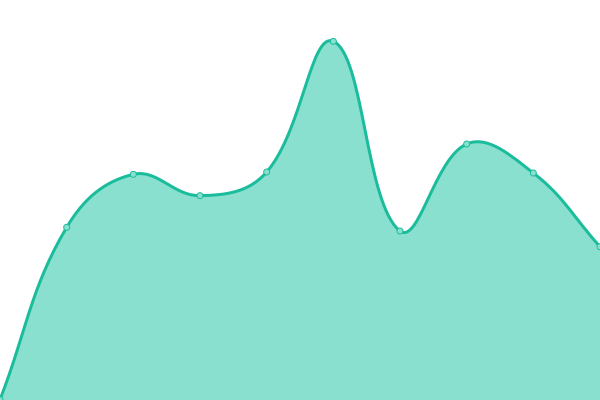 1538ms
     
 | 

<a href="https://gitetsu.github.io/invidious-instances-upptime/history/yewtu-be">99.24%</a>
    

|  [invidious.kavin.rocks](https://invidious.kavin.rocks/) | 🟥 Down | [invidious-kavin-rocks.yml](https://github.com/gitetsu/invidious-instances-upptime/commits/HEAD/history/invidious-kavin-rocks.yml) | 

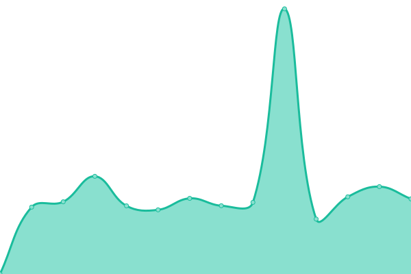 964ms
     
 | 

<a href="https://gitetsu.github.io/invidious-instances-upptime/history/invidious-kavin-rocks">0.00%</a>
    

|  [vid.puffyan.us](https://vid.puffyan.us/) | 🟩 Up | [vid-puffyan-us.yml](https://github.com/gitetsu/invidious-instances-upptime/commits/HEAD/history/vid-puffyan-us.yml) | 

 1212ms
     
 | 

<a href="https://gitetsu.github.io/invidious-instances-upptime/history/vid-puffyan-us">100.00%</a>
    

|  [invidious.namazso.eu](https://invidious.namazso.eu/) | 🟩 Up | [invidious-namazso-eu.yml](https://github.com/gitetsu/invidious-instances-upptime/commits/HEAD/history/invidious-namazso-eu.yml) | 

 722ms
     
 | 

<a href="https://gitetsu.github.io/invidious-instances-upptime/history/invidious-namazso-eu">100.00%</a>
    

|  [inv.riverside.rocks](https://inv.riverside.rocks/) | 🟩 Up | [inv-riverside-rocks.yml](https://github.com/gitetsu/invidious-instances-upptime/commits/HEAD/history/inv-riverside-rocks.yml) | 

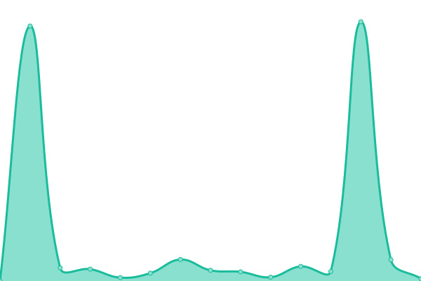 2973ms
     
 | 

<a href="https://gitetsu.github.io/invidious-instances-upptime/history/inv-riverside-rocks">98.05%</a>
    

|  [yt.artemislena.eu](https://yt.artemislena.eu/) | 🟩 Up | [yt-artemislena-eu.yml](https://github.com/gitetsu/invidious-instances-upptime/commits/HEAD/history/yt-artemislena-eu.yml) | 

 751ms
     
 | 

<a href="https://gitetsu.github.io/invidious-instances-upptime/history/yt-artemislena-eu">99.81%</a>
    

|  [invidious.flokinet.to](https://invidious.flokinet.to/) | 🟩 Up | [invidious-flokinet-to.yml](https://github.com/gitetsu/invidious-instances-upptime/commits/HEAD/history/invidious-flokinet-to.yml) | 

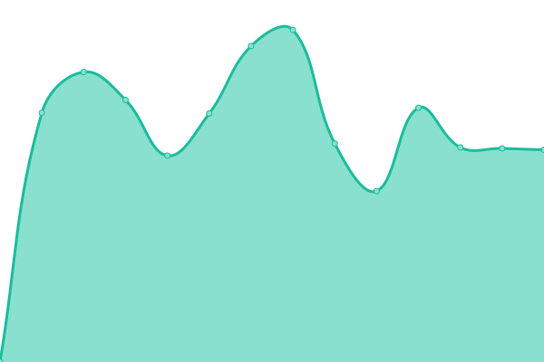 1411ms
     
 | 

<a href="https://gitetsu.github.io/invidious-instances-upptime/history/invidious-flokinet-to">99.01%</a>
    

|  [invidious.esmailelbob.xyz](https://invidious.esmailelbob.xyz/) | 🟩 Up | [invidious-esmailelbob-xyz.yml](https://github.com/gitetsu/invidious-instances-upptime/commits/HEAD/history/invidious-esmailelbob-xyz.yml) | 

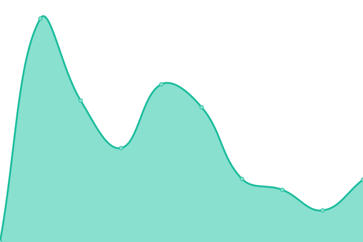 857ms
     
 | 

<a href="https://gitetsu.github.io/invidious-instances-upptime/history/invidious-esmailelbob-xyz">90.70%</a>
    

|  [inv.bp.projectsegfau.lt](https://inv.bp.projectsegfau.lt/) | 🟩 Up | [inv-bp-projectsegfau-lt.yml](https://github.com/gitetsu/invidious-instances-upptime/commits/HEAD/history/inv-bp-projectsegfau-lt.yml) | 

 4852ms
     
 | 

<a href="https://gitetsu.github.io/invidious-instances-upptime/history/inv-bp-projectsegfau-lt">61.52%</a>
    

|  [y.com.sb](https://y.com.sb/) | 🟩 Up | [y-com-sb.yml](https://github.com/gitetsu/invidious-instances-upptime/commits/HEAD/history/y-com-sb.yml) | 

 1515ms
     
 | 

<a href="https://gitetsu.github.io/invidious-instances-upptime/history/y-com-sb">100.00%</a>
    

|  [invidious.tiekoetter.com](https://invidious.tiekoetter.com/) | 🟩 Up | [invidious-tiekoetter-com.yml](https://github.com/gitetsu/invidious-instances-upptime/commits/HEAD/history/invidious-tiekoetter-com.yml) | 

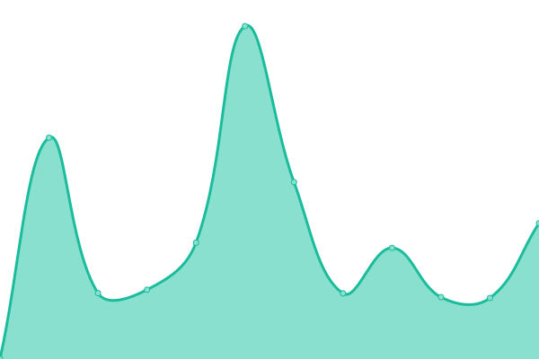 2333ms
     
 | 

<a href="https://gitetsu.github.io/invidious-instances-upptime/history/invidious-tiekoetter-com">99.47%</a>
    

|  [invidious.nerdvpn.de](https://invidious.nerdvpn.de/) | 🟩 Up | [invidious-nerdvpn-de.yml](https://github.com/gitetsu/invidious-instances-upptime/commits/HEAD/history/invidious-nerdvpn-de.yml) | 

 569ms
     
 | 

<a href="https://gitetsu.github.io/invidious-instances-upptime/history/invidious-nerdvpn-de">100.00%</a>
    

|  [inv.vern.cc](https://inv.vern.cc/) | 🟥 Down | [inv-vern-cc.yml](https://github.com/gitetsu/invidious-instances-upptime/commits/HEAD/history/inv-vern-cc.yml) | 

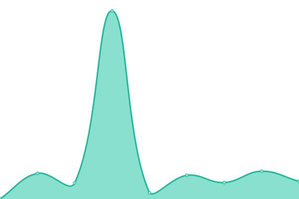 1490ms
     
 | 

<a href="https://gitetsu.github.io/invidious-instances-upptime/history/inv-vern-cc">78.42%</a>
    

|  [invidious.slipfox.xyz](https://invidious.slipfox.xyz/) | 🟩 Up | [invidious-slipfox-xyz.yml](https://github.com/gitetsu/invidious-instances-upptime/commits/HEAD/history/invidious-slipfox-xyz.yml) | 

 710ms
     
 | 

<a href="https://gitetsu.github.io/invidious-instances-upptime/history/invidious-slipfox-xyz">100.00%</a>
    

|  [watch.thekitty.zone](https://watch.thekitty.zone/) | 🟥 Down | [watch-thekitty-zone.yml](https://github.com/gitetsu/invidious-instances-upptime/commits/HEAD/history/watch-thekitty-zone.yml) | 

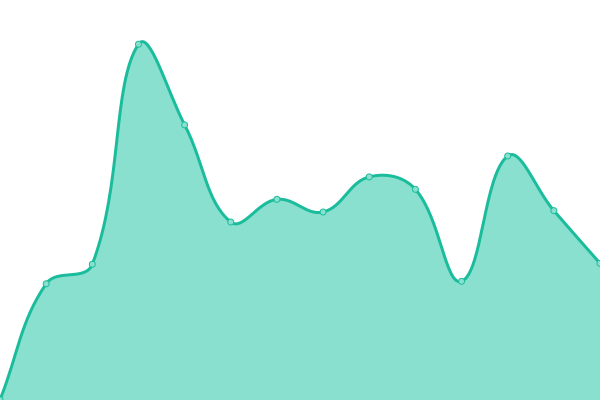 0ms
     
 | 

<a href="https://gitetsu.github.io/invidious-instances-upptime/history/watch-thekitty-zone">0.00%</a>
    

|  [invidious.dhusch.de](https://invidious.dhusch.de/) | 🟥 Down | [invidious-dhusch-de.yml](https://github.com/gitetsu/invidious-instances-upptime/commits/HEAD/history/invidious-dhusch-de.yml) | 

 0ms
     
 | 

<a href="https://gitetsu.github.io/invidious-instances-upptime/history/invidious-dhusch-de">0.00%</a>
    

|  [inv.odyssey346.dev](https://inv.odyssey346.dev/) | 🟩 Up | [inv-odyssey346-dev.yml](https://github.com/gitetsu/invidious-instances-upptime/commits/HEAD/history/inv-odyssey346-dev.yml) | 

 155ms
     
 | 

<a href="https://gitetsu.github.io/invidious-instances-upptime/history/inv-odyssey346-dev">100.00%</a>
    

|  [invidious.baczek.me](https://invidious.baczek.me/) | 🟩 Up | [invidious-baczek-me.yml](https://github.com/gitetsu/invidious-instances-upptime/commits/HEAD/history/invidious-baczek-me.yml) | 

 1079ms
     
 | 

<a href="https://gitetsu.github.io/invidious-instances-upptime/history/invidious-baczek-me">100.00%</a>
    

|  [invidious.weblibre.org](https://invidious.weblibre.org/) | 🟥 Down | [invidious-weblibre-org.yml](https://github.com/gitetsu/invidious-instances-upptime/commits/HEAD/history/invidious-weblibre-org.yml) | 

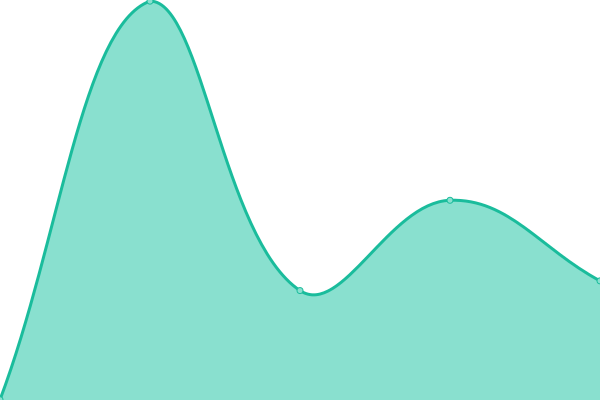 0ms
     
 | 

<a href="https://gitetsu.github.io/invidious-instances-upptime/history/invidious-weblibre-org">0.00%</a>
    

|  [invidious.privacydev.net](https://invidious.privacydev.net/) | 🟩 Up | [invidious-privacydev-net.yml](https://github.com/gitetsu/invidious-instances-upptime/commits/HEAD/history/invidious-privacydev-net.yml) | 

 3796ms
     
 | 

<a href="https://gitetsu.github.io/invidious-instances-upptime/history/invidious-privacydev-net">80.61%</a>
    

|  [yt.funami.tech](https://yt.funami.tech/) | 🟥 Down | [yt-funami-tech.yml](https://github.com/gitetsu/invidious-instances-upptime/commits/HEAD/history/yt-funami-tech.yml) | 

 704ms
     
 | 

<a href="https://gitetsu.github.io/invidious-instances-upptime/history/yt-funami-tech">45.00%</a>
    

|  [invidious.drivet.xyz](https://invidious.drivet.xyz/) | 🟥 Down | [invidious-drivet-xyz.yml](https://github.com/gitetsu/invidious-instances-upptime/commits/HEAD/history/invidious-drivet-xyz.yml) | 

 0ms
     
 | 

<a href="https://gitetsu.github.io/invidious-instances-upptime/history/invidious-drivet-xyz">0.00%</a>
    

|  [vid.priv.au](https://vid.priv.au/) | 🟩 Up | [vid-priv-au.yml](https://github.com/gitetsu/invidious-instances-upptime/commits/HEAD/history/vid-priv-au.yml) | 

 6621ms
     
 | 

<a href="https://gitetsu.github.io/invidious-instances-upptime/history/vid-priv-au">98.26%</a>
    

|  [invidious.lidarshield.cloud](https://invidious.lidarshield.cloud/) | 🟥 Down | [invidious-lidarshield-cloud.yml](https://github.com/gitetsu/invidious-instances-upptime/commits/HEAD/history/invidious-lidarshield-cloud.yml) | 

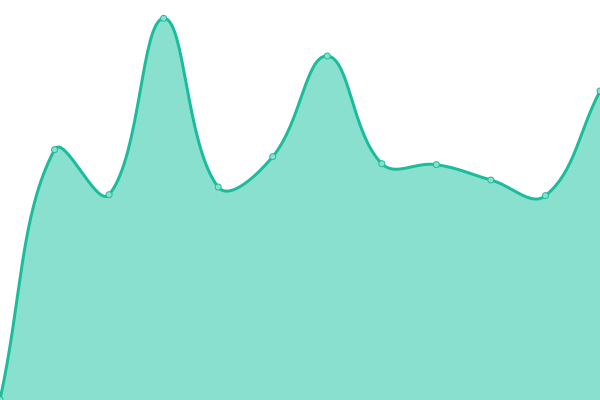 259ms
     
 | 

<a href="https://gitetsu.github.io/invidious-instances-upptime/history/invidious-lidarshield-cloud">15.72%</a>
    

|  [invidious.silur.me](https://invidious.silur.me/) | 🟩 Up | [invidious-silur-me.yml](https://github.com/gitetsu/invidious-instances-upptime/commits/HEAD/history/invidious-silur-me.yml) | 

 2698ms
     
 | 

<a href="https://gitetsu.github.io/invidious-instances-upptime/history/invidious-silur-me">100.00%</a>
    

|  [iv.melmac.space](https://iv.melmac.space/) | 🟩 Up | [iv-melmac-space.yml](https://github.com/gitetsu/invidious-instances-upptime/commits/HEAD/history/iv-melmac-space.yml) | 

 803ms
     
 | 

<a href="https://gitetsu.github.io/invidious-instances-upptime/history/iv-melmac-space">97.76%</a>
    

|  [iv.ggtyler.dev](https://iv.ggtyler.dev/) | 🟩 Up | [iv-ggtyler-dev.yml](https://github.com/gitetsu/invidious-instances-upptime/commits/HEAD/history/iv-ggtyler-dev.yml) | 

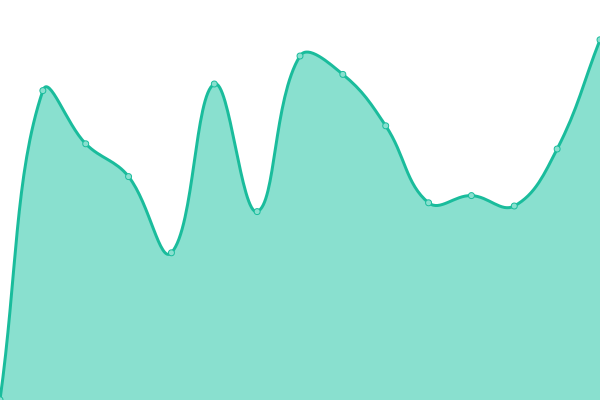 965ms
     
 | 

<a href="https://gitetsu.github.io/invidious-instances-upptime/history/iv-ggtyler-dev">100.00%</a>
    

|  [invidious.epicsite.xyz](https://invidious.epicsite.xyz/) | 🟥 Down | [invidious-epicsite-xyz.yml](https://github.com/gitetsu/invidious-instances-upptime/commits/HEAD/history/invidious-epicsite-xyz.yml) | 

 0ms
     
 | 

<a href="https://gitetsu.github.io/invidious-instances-upptime/history/invidious-epicsite-xyz">0.00%</a>
    

|  [invidious.sethforprivacy.com](https://invidious.sethforprivacy.com/) | 🟥 Down | [invidious-sethforprivacy-com.yml](https://github.com/gitetsu/invidious-instances-upptime/commits/HEAD/history/invidious-sethforprivacy-com.yml) | 

 211ms
     
 | 

<a href="https://gitetsu.github.io/invidious-instances-upptime/history/invidious-sethforprivacy-com">0.00%</a>
    

|  [yt.oelrichsgarcia.de](https://yt.oelrichsgarcia.de/) | 🟩 Up | [yt-oelrichsgarcia-de.yml](https://github.com/gitetsu/invidious-instances-upptime/commits/HEAD/history/yt-oelrichsgarcia-de.yml) | 

 969ms
     
 | 

<a href="https://gitetsu.github.io/invidious-instances-upptime/history/yt-oelrichsgarcia-de">99.84%</a>
    

<!--end: status pages-->

[**Visit our status website →**](https://gitetsu.github.io/invidious-instances-upptime)

## 📄 License

- Powered by: [Upptime](https://github.com/upptime/upptime)
- Code: [MIT](./LICENSE) © [gitetsu](https://gitetsu.github.io/invidious-instances-upptime)
- Data in the `./history` directory: [Open Database License](https://opendatacommons.org/licenses/odbl/1-0/)
